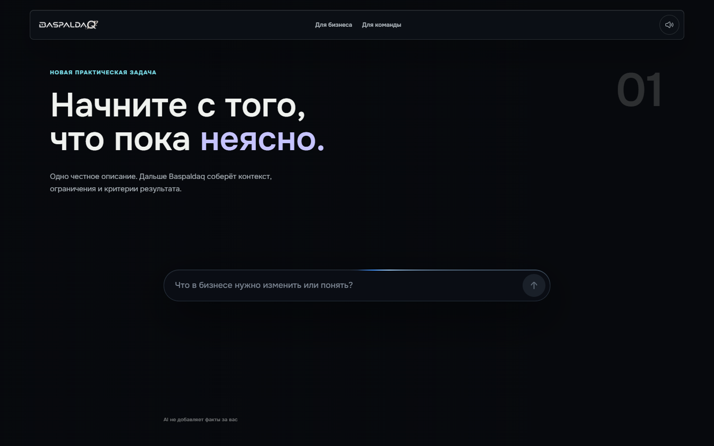
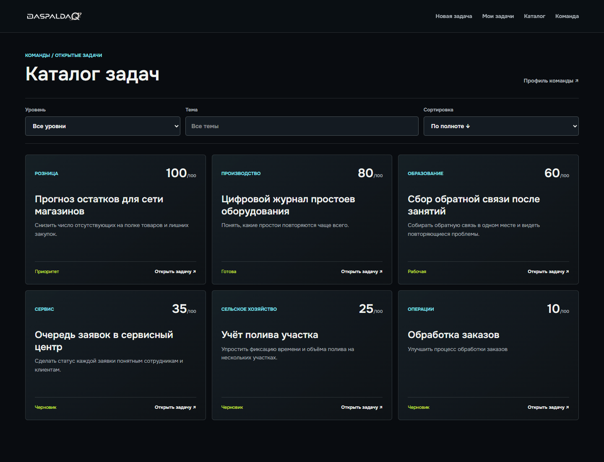
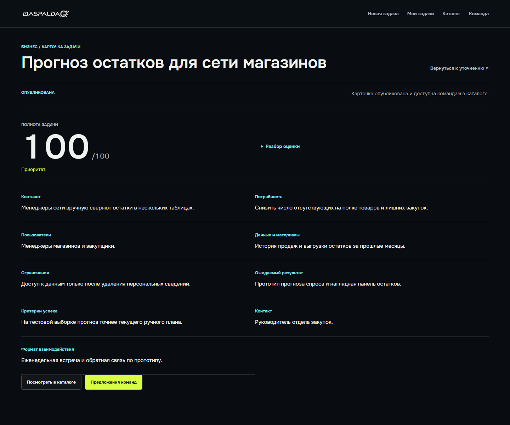
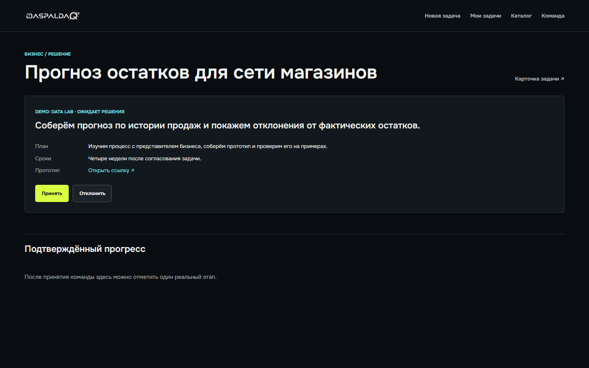
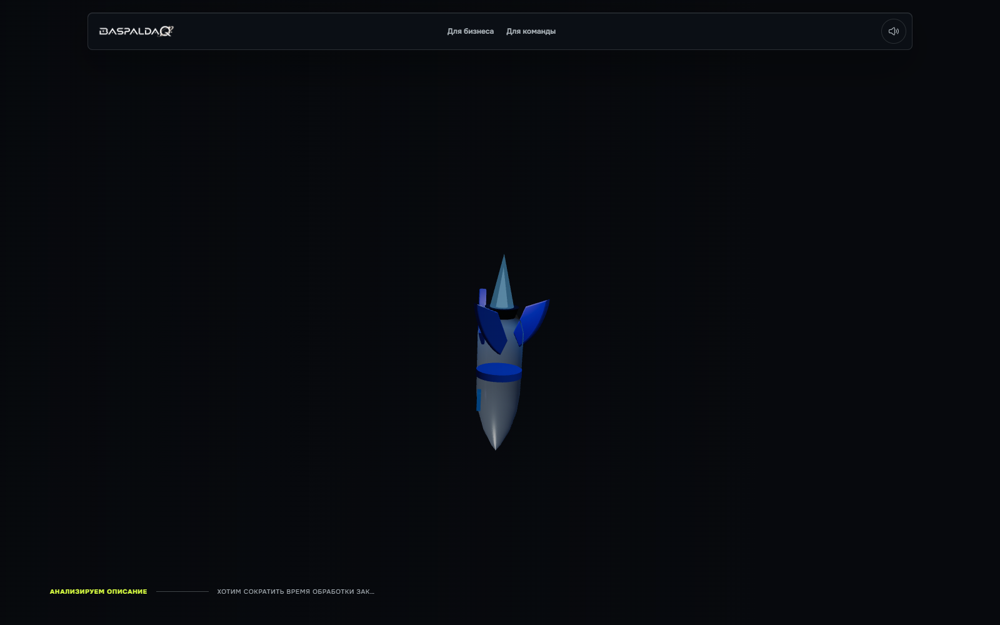
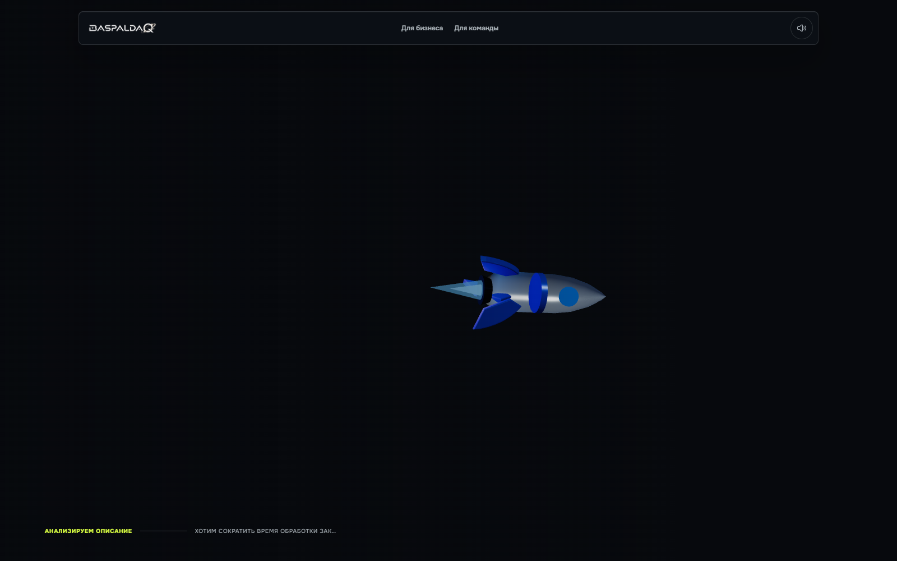
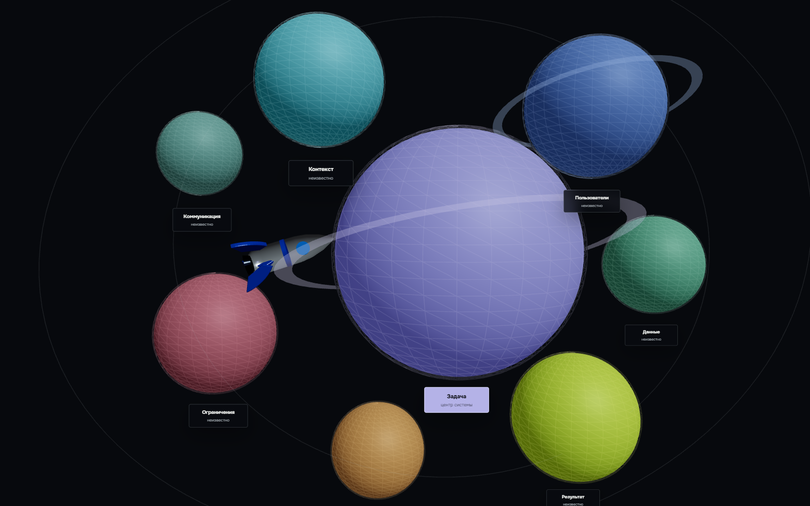
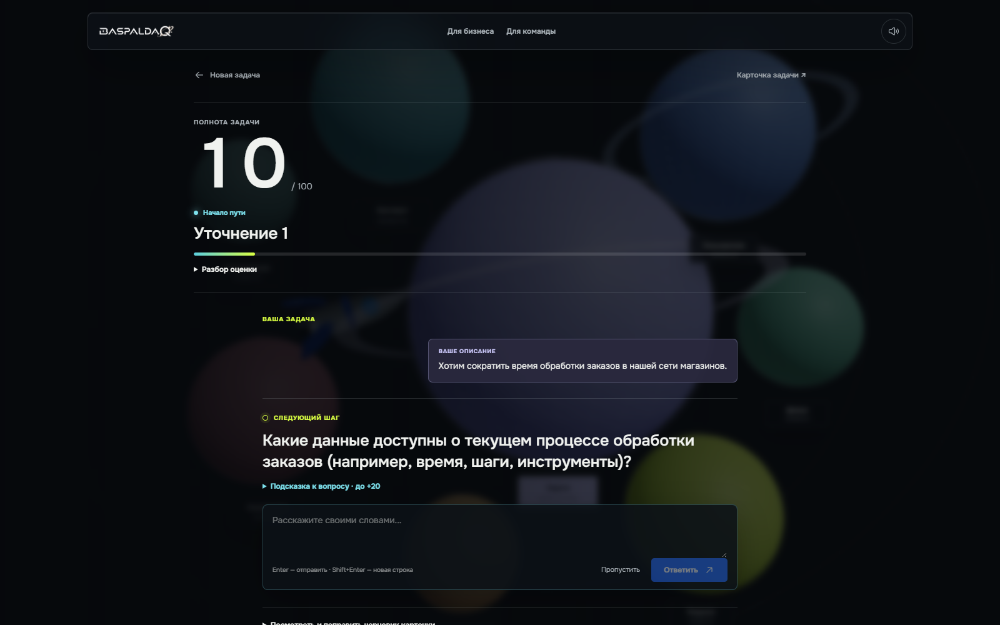

# Baspaldaq

| Создание задачи | Каталог |
| --- | --- |
|  |  |
| Карточка задачи | Предложения команд |
|  |  |

### Полёт и 3D-сцена

| Запуск ракеты | Поворот к системе |
| --- | --- |
|  |  |
| Система планет | AI-диалог |
|  |  |

Реальные десктопные кадры приложения. На отдельном снимке системы планет интерфейс временно скрыт для обзора 3D-сцены.

Baspaldaq turns a business problem into a published task that student teams can answer with proposals. The hackathon flow is: describe a problem, clarify it with AI, review and edit the task card, confirm and publish it, receive team proposals, and make the decision manually.

## Stack

- React, Vite, Motion and Three.js in `client/`
- Express 5, Prisma and SQLite in `server/`
- OpenAI through the server only, using the AI SDK
- Committed Prisma migrations in `server/prisma/migrations/`

The browser never receives `OPENAI_API_KEY`. AI extracts only facts supported by exact quotes from the user's description, answers, or manual edits. The server computes the readiness score from seven weighted dimensions. AI questions and explanations adapt to the user's missing information, but model output is rendered as validated text and known React components, never as executable HTML.

## Run Locally

Requires Node.js 20.19+ and npm 10+. `package-lock.json` locks the JavaScript dependencies; this project does not need Python's `requirements.txt`. On Windows, the fastest setup is:

```powershell
.\scripts\setup.ps1 -Seed
```

Omit `-Seed` to start with an empty database. The script creates `.env` only if it is missing, installs exact dependencies with `npm ci`, generates Prisma Client, and applies migrations. It never overwrites an existing `.env`.

The equivalent manual commands are:

```powershell
npm ci
Copy-Item .env.example .env
npm run prisma:generate
npm run prisma:deploy
npm run dev
```

Set `OPENAI_API_KEY` only in the ignored local `.env`. Set `PORT`, `CLIENT_ORIGIN`, `DATABASE_URL` and `VITE_API_URL` there as needed. Vite prints the frontend URL. The API listens on `PORT`; `GET /api/health` checks the database connection. The default SQLite file is `server/prisma/dev.db`.

The role switch is in the navigation: business creates and manages tasks; student teams use the catalog and team profile. Open `/business` for tasks, `/catalog` for published tasks, and `/team` to create or update a team profile. Browser storage remembers only the selected team ID; all tasks, teams, proposals, decisions and milestone points live in SQLite.

## Demo Data

```powershell
npm run db:seed
```

This idempotent command adds five synthetic drafts, five published task cards, five synthetic teams and five proposals. Their IDs begin with `demo-`, and their prototype links are illustrative, not live team projects. It does not overwrite existing records. Production seeding requires `ALLOW_DEMO_SEED=true` explicitly.

## Main API

| Action | Endpoint |
| --- | --- |
| Save draft | `POST /api/tasks` |
| Analyze draft | `POST /api/tasks/:id/analyze` |
| Answer or skip | `POST /api/tasks/:id/answers` |
| Read task/questions | `GET /api/tasks/:id`, `GET /api/tasks/:id/questions` |
| Edit card | `PATCH /api/tasks/:id` |
| Confirm and publish | `POST /api/tasks/:id/confirm`, `POST /api/tasks/:id/publish` |
| Catalog | `GET /api/tasks?published=true&readiness=ready&topic=...&sort=score_desc` |
| Teams | `GET/POST /api/teams`, `GET/PATCH /api/teams/:id` |
| Proposals | `GET/POST /api/tasks/:id/proposals`, `GET /api/proposals/:id`, `PATCH /api/proposals/:id/status` |
| Milestones | `GET/POST /api/tasks/:id/milestones`, `PATCH /api/milestones/:id/confirm` |

Readiness is `draft` (0-39), `workable` (40-69), `ready` (70-89), or `priority` (90-100). Every published task remains in the catalog, including low-scoring ones. Proposals have `PENDING`, `ACCEPTED`, or `REJECTED` status. The business can accept several teams or none. Confirming a milestone for an accepted team awards 10 points exactly once.

## Validation

```powershell
npm run prisma:validate
npm test --workspace server
npm run build
```

The browser test needs Microsoft Edge (or `BROWSER_EXECUTABLE`) and a local running app with at least one published task. It captures desktop and mobile screenshots in ignored `client/screenshots/`, verifies wheel scrolling, and clicks through publish, proposal, business decision, and milestone confirmation. Temporary records are removed after the test.

```powershell
$env:TEST_BASE_URL = 'http://localhost:5173'
npm run test:ui
```

## Deployment Boundary

For a separately hosted client, set `VITE_API_URL` to the public API origin at build time and `CLIENT_ORIGIN` to the exact allowed frontend origin. Use persistent writable storage for SQLite; an ephemeral disk loses data on redeploy. Run `npm run prisma:generate` and `npm run prisma:deploy` before `npm start`.

This hackathon MVP intentionally has no login or authorization, as allowed by the brief. Role selection is a workflow convenience, **not access control**: proposal decisions and task edits are not protected from other visitors. Add real identity and authorization before exposing it as a production multi-tenant service.
